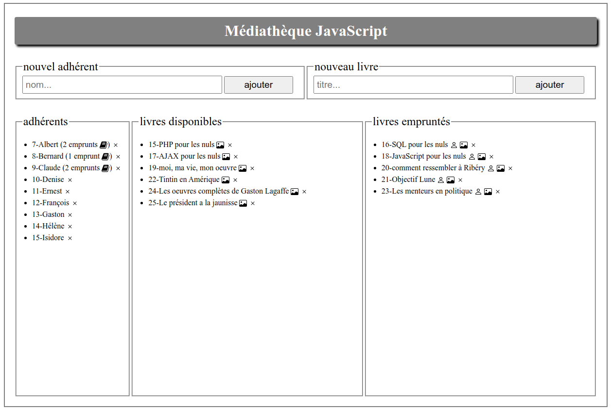
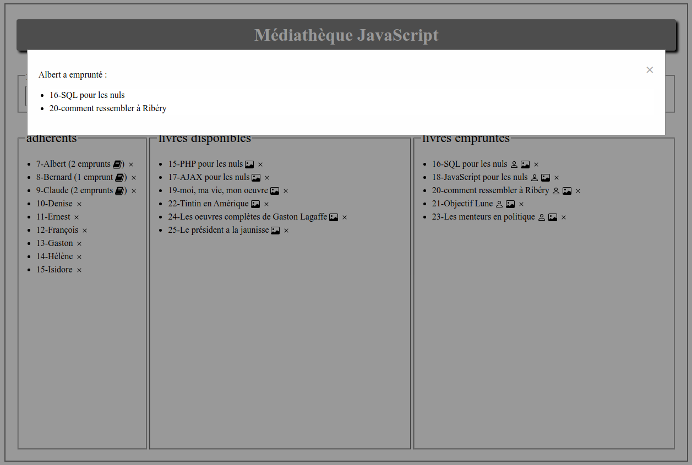
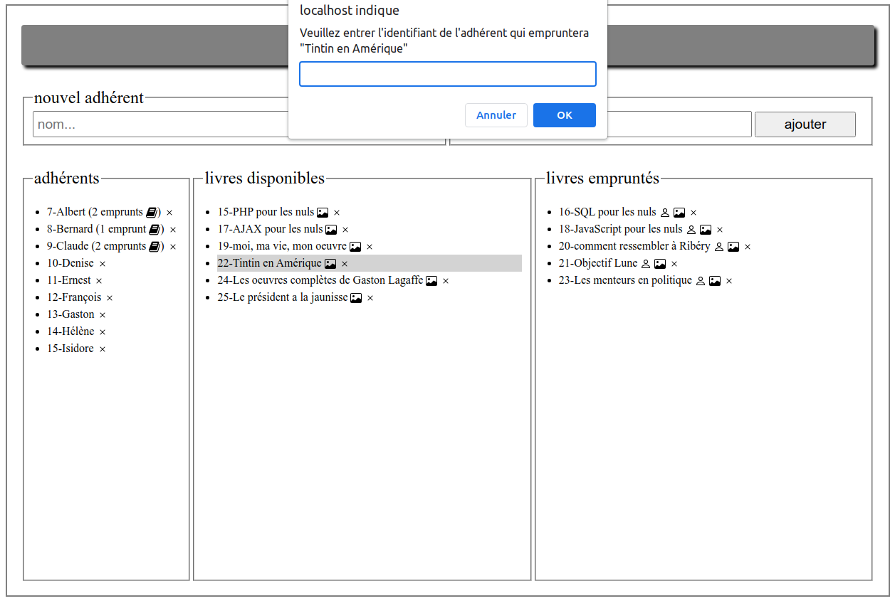
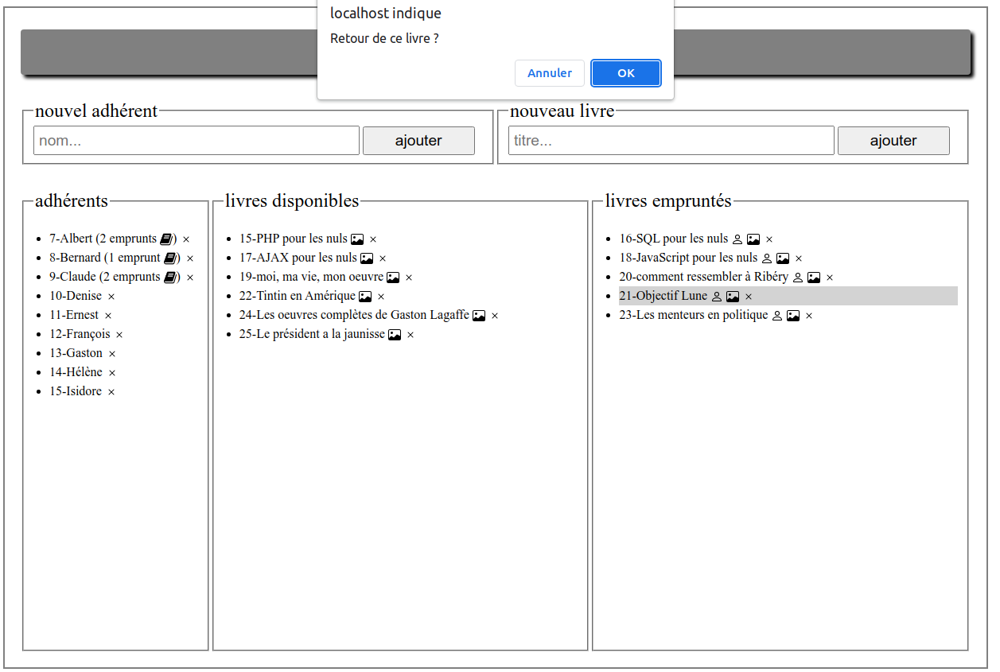

#  R.4.01 Développement Web - JavaScript

### IUT Montpellier-Sète – Département Informatique

## Projet final de JavaScript
#### _Thème : AJAX, mise en place d'une application médiathèque_

Commencez par *fork* du `ProjetMediatheque` **une fois par groupe de projet**.
Ce *fork* doit se trouver dans
https://gitlabinfo.iutmontp.univ-montp2.fr/r4.01-developpementweb/etu/votre_login_IUT/ProjetMediatheque

**Date limite de rendu :** Vendredi 31 mars 2023 (23:59)

## INTRODUCTION

Dans ce module, vous aurez deux notes : l'évaluation de ce projet (60%) et l'examen écrit final (40%). 

Vous devez travailler en binôme, ou bien exceptionnellement seul. Le rendu se fera à la fois en poussant votre travail sur le dépôt *GitLab* et en communiquant à votre enseignant une adresse accessible de l'extérieur sur laquelle on pourra tester directement dans un navigateur les fonctionnalités implémentées (par exemple le lien vers votre répertoire `public_html`).

Pour ce travail, vous allez devoir programmer le fonctionnement d’une mini médiathèque. Vous aurez à gérer des adhérents, des livres et des emprunts.

Le principe est d'utiliser la technologie AJAX pour communiquer avec une base de données dans les deux sens : l'affichage devra refléter les données dans la BDD et les actions de l'utilisateur pourront modifier le contenu de la BDD.

Vous disposez pour ce projet, d’une architecture de départ pour l’environnement web, avec les fichiers `mediatheque.html` et `styles.css`. Vous pouvez les modifier.

L’interface par défaut de la médiathèque pourra ressembler à cette capture d’écran une fois que vous aurez chargé les données depuis la BDD :

<p style="text-align:center">
	
</p>
<p style="text-align:center">
	capture d’écran 1 – affichage classique
</p>

## Fonctionnalités de base à développer

Cette application travaillera en lien avec une base de données que vous pourrez importer grâce au fichier `mediatheque.sql`. Les entités `adherent` et `livre` sont matérialisées par des tables, ainsi que la relation `emprunt` entre un `adherent` et un `livre`.

Vous allez développer des fonctionnalités qui permettent de gérer les entrées et sorties de la médiathèque. Plus tard vous pourrez complexifier la base de données si vous souhaiter construire une médiathèque plus élaborée.

L’utilisateur de la médiathèque pourra au minimum :

+ enregistrer un nouvel adhérent ;
+ enregistrer un nouveau livre ;
+ voir à tout moment la liste des adhérents et le nombre de livres qu'ils ont empruntés;
+ voir à tout moment la liste des livres disponibles et celle des livres
  empruntés ;
+ avoir accès, par un clic sur le nom de l’adhérent, à la liste des livres qu’il a en sa possession en ce moment ;
+ avoir accès, par un clic sur le titre du livre disponible à l’emprunt, à une fenêtre qui permet de prêter le livre à un adhérent ;
+ avoir accès, par un clic sur le titre du livre prêté, à une fenêtre proposant la restitution du livre.

Pour les interactions avec l'utilisateur, vous pouvez utiliser les méthodes
natives `alert()`, `prompt()` et `confirm()` pour vous faciliter la tâche.

L'état de l'application doit être conservé dans la base de données, et rechargé à chaque nouvelle ouverture de la page.

Chaque action modifiant la base de données devra provoquer une mise à jour automatique de l’interface en temps réel. Voici quelques captures d’écran montrant quelques états possibles de l'interface en fonction des actions.

### capture d'écran – clic sur un adhérent
<p style="text-align:center">
	
</p>


### capture d'écran – clic sur un livre disponible
<p style="text-align:center">
	
</p>


### capture d'écran – clic sur un livre emprunté
<p style="text-align:center">
	
</p>

## Communication avec la base de données

La plupart des outils pour communiquer avec la base de données vous sont fournis :
- Le fichier `mediatheque.sql` vous permettra de créer les tables, et y placer quelques valeurs d'exemple, que vous pourrez modifier comme vous le souhaitez.
- Le fichier `php/Model/Conf.php` contient la configuration de connexion à la base de données. Vous devez remplir ces informations pour que le script puisse accéder à votre base de données (les commentaires décrivent les informations pour vous connecter à la base de données sur votre compte à l'IUT).
- Pour chacun des contrôleurs `ControllerAdherent` `ControllerEmprunt`
  `ControllerLivre`, nous fournissons 3 actions : `readAll()`, `create()` et `delete()`.
- Vous pouvez faire les requêtes suivantes : 
  - `ControllerAdherent.php?action=readAll` pour accéder à tous les adhérents au format
    ```json
	{"idAdherent":7,"nomAdherent":"Albert"}
	```
    Idem pour les emprunts qui sont renvoyées au format
	```json
	{"idAdherent":7,"idLivre":16}
	```
	Idem pour les livres qui sont renvoyées au format
	```json
	{"idLivre":15,"titreLivre":"PHP pour les nuls"}
	```
  - `ControllerAdherent.php?create=readAll` attend des données `POST` comme
    `nom=xxx` et renvoie le nouvel identifiant, *par ex.* `"43"`.  
    Idem pour les livres : données `POST` comme `titre=xxx`, renvoie le nouvel identifiant.  
	Idem pour les emprunts : données `POST` comme `idAdherent=43&idLivre=36` et ne retourne rien
  - `ControllerAdherent.php?action=delete&id=12` pour supprimer l'adhérent
    d'identifiant `12`. Idem pour les livres.
  - `ControllerEmprunt.php?action=delete&idLivre=12` pour supprimer l'emprunt du
    livre d'identifiant `12`.

Il est possible de faire tout le projet en utilisant ces scripts, mais si vous le souhaitez **vous pouvez les modifier comme ça vous arrange** (et éventuellement ajouter d'autres scripts).

## Conseils et Consignes

- Maintenez une organisation claire des fichiers et du code
  - Placez les fichiers dans les répertoires adaptés
  - Nommez vos fonctions, méthodes et variables pour que leur signification soit claire
  - Commentez les fonctions dont l'action n'est pas immédiatement compréhensibles
  - Regroupez votre code dans des classes lorsque c'est pertinent.
- Il existe de nombreuses façons d'implémenter les différentes fonctionnalités. Réfléchissez éventuellement un peu aux différentes alternatives avant de vous lancer dans la programmation, et éventuellement envisagez de refactoriser votre travail si vous pensez que les choix que vous avez fait initialement ne sont pas pertinents.

**Important :** Vous pouvez discuter avec les autres mais chacun (ou chaque binôme) doit écrire son code, ne copiez pas des morceaux de code d'un projet à l'autre sous peine d'être fortement pénalisés !


## Autres fonctionnalités

En plus du minimum qui est demandé, vous devrez ajouter des fonctionnalités
supplémentaires à votre application pour obtenir la note maximale. Quelques autres
suggestions :

* faire des requêtes `GET` et des requêtes `POST` depuis le JavaScript ;
* Suppression : Vous pouvez ajouter des boutons pour supprimer les adhérents et
  les livres qui ont été enregistrés (clic sur le bouton  )
*  Utilisation d'une API : Vous pouvez utiliser une API de votre choix pour
   ajouter une fonctionnalité au site. Nous vous suggérons d'utiliser 
   [l'API de *Google Books*](https://developers.google.com/books/docs/v1/using#PerformingSearch)
   pour afficher la couverture d'un livre à partir de son titre (clic sur
   ).
* afficher l'emprunteur d'un livre en cliquant sur 
  .
* Utilisation de `fetch()` et `async`/`await` : Vous devrez utiliser les deux
  syntaxes qui ont été présentées dans le
  [TD6](https://gitlabinfo.iutmontp.univ-montp2.fr/r4.01-developpementweb/TD6).
